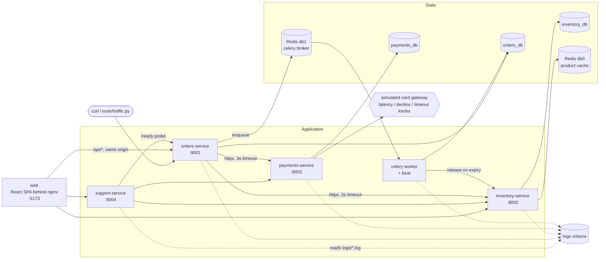
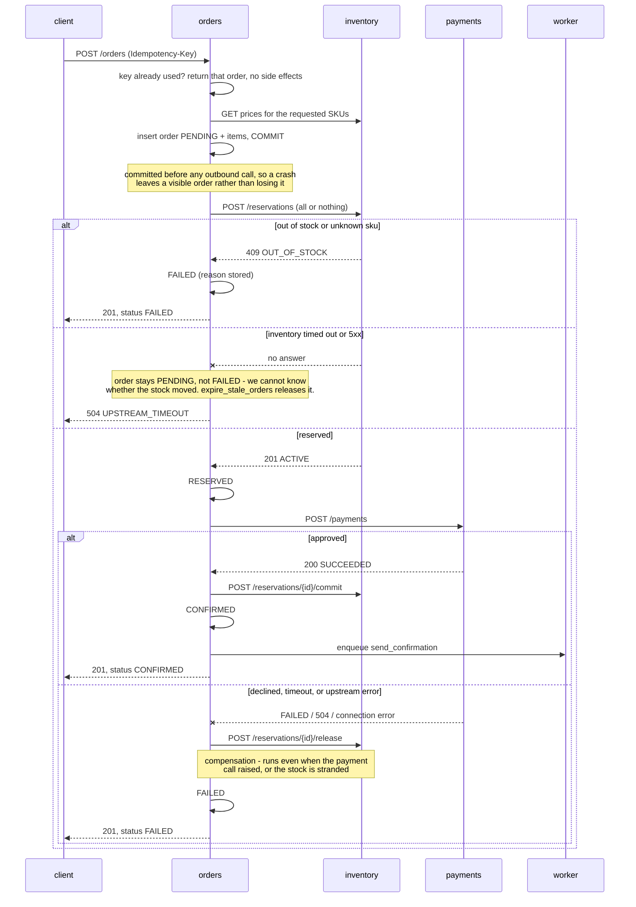
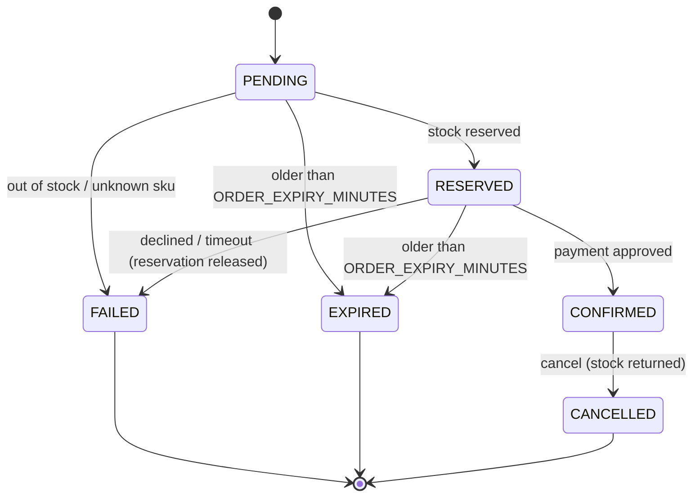

# Architecture

Three FastAPI services that run the business, a fourth that only observes them, a Celery
worker, one PostgreSQL instance holding three separate databases, Redis doing two
unrelated jobs, and a React front end that is both the shop and the support console. It is
deliberately more moving parts than the problem needs: the point of the project is to have
somewhere for realistic failures to happen.

## The shape of it

Monitoring sits alongside it: Prometheus scrapes `/metrics` on each service and
`worker:9100`, Grafana reads Prometheus, and every service writes the same JSON log lines
to both stdout and `logs/<service>.log`.

Those log files have two readers. `tools/logtool.py` is the command-line one. support-service
is the HTTP one, and it is what the ops console in the browser talks to. Both call the same
functions in `common/logsearch.py`, so the console and the CLI can never disagree about what
counts as an error or which request was slowest.

## Who owns what

| Service | Owns | Knows about |
|---|---|---|
| inventory | products, stock, reservations | nothing else |
| payments | payments, the simulated gateway | nothing else |
| orders | orders, items, events, notifications | inventory and payments, over HTTP only |
| support | nothing at all | everyone, read-only |
| web | nothing | the four above, through nginx |

support-service is the odd one out and deliberately so. It has no database, no migrations
and no writes: it reads the shared log volume read-only, calls the other services' own
`/ready` endpoints, and reads the incident files off disk. A support tool that can change
the system it is diagnosing is a support tool you cannot trust during an incident.

The dependency arrows only ever point one way. inventory and payments have no idea orders
exists — they cannot call back into it, and they do not share its database. That is what
makes the failure modes interesting: orders has to cope with its dependencies being slow,
declining, or gone, and it cannot fix anything by reaching into their tables.

There are no foreign keys across databases. `stock_reservations.order_id` is a plain
indexed uuid. Nothing in PostgreSQL will stop a reservation outliving its order — only the
application will, and only if it is written correctly. That gap is the whole reason
`expire_stale_orders` exists.

## Placing an order

The interesting path, and the one most of the incidents will touch.

Two things in that diagram are worth defending in an interview.

**The order is committed as PENDING before anything else happens.** It costs an extra
round trip. In exchange, a process that dies halfway through leaves a row someone can find
and a background job can clean up, instead of a customer who was charged for an order that
does not exist.

**The release is compensation, not a rollback.** By the time payment fails, the
reservation is committed in a different database. There is no transaction spanning the
two, so the only way back is another call that undoes it. If that call also fails, the
system is genuinely inconsistent and the code says so loudly in the log rather than
pretending otherwise.

## State machine

`orders/app/state.py` is the only place a status is assigned. Every transition writes an
`order_events` row with the request id that caused it, which is what makes an order's
history readable long after the logs have rotated.

Anything not on that diagram raises `IllegalTransition` and returns 409. It is never
silently ignored — a status change that quietly does nothing is how orders go missing.

## Request tracing

One `X-Request-ID` follows a request through everything:

1. `RequestContextMiddleware` reads the header or mints one, and binds it to a
   `ContextVar`.
2. Every log line picks it up automatically, in all three services and in the worker.
3. The httpx clients forward it on every outbound call via an event hook.
4. Celery carries it in the task message headers, and the worker rebinds it on
   `task_prerun`.
5. It comes back in the response header and inside every error body.

So `logtool trace <id>` can reconstruct a request across four processes. Without it, the
only way to correlate three log files is by timestamp and hope.

The middleware is written against the raw ASGI interface rather than
`BaseHTTPMiddleware`, because `BaseHTTPMiddleware` runs the handler in a separate task and
loses exactly the ContextVars this depends on.

## Background work

Celery, broker on Redis db1, no result backend — nothing ever asks for a return value.

| Task | Schedule | Why it exists |
|---|---|---|
| `send_confirmation` | after CONFIRMED | The email. Retries five times with backoff; a unique index on `(order_id, kind)` makes a retry safe |
| `expire_stale_orders` | every 60s | Releases stock held by orders that never finished. This is the safety net under the missing cross-database transaction |
| `daily_sales_report` | 00:05 IST | Yesterday's numbers, on the IST business day |

The worker runs a thread pool rather than the default prefork pool, so there is one
process and therefore one Prometheus registry to scrape. The tasks are all database and
HTTP waits, so threads lose nothing.

## Data and time

Money is integer paise everywhere. No float ever touches an amount — `0.1 + 0.2` is the
oldest bug in commerce.

Timestamps are stored as `timestamptz` in UTC. The business is in India, so "today" for a
report means the IST calendar day, converted to a half-open UTC range `[start, end)` at
query time. The conversion uses `zoneinfo`, not a hardcoded `+05:30`, so it stays correct
if the rules ever change.

## Where it is deliberately fragile

Sized for a laptop, and for failures to be reachable:

- `DB_POOL_SIZE=5`, `DB_MAX_OVERFLOW=5` — ten connections per service, so exhaustion is
  reachable without serious load.
- `PRODUCT_CACHE_TTL=60` — short enough that staleness is observable.
- `GATEWAY_FAILURE_RATE=0.05` — one order in twenty is declined by design. Anything that
  treats a decline as an error will look broken immediately, which is the point.
- No retries on the outbound calls, on purpose. Retrying a non-idempotent POST is how you
  charge someone twice.
